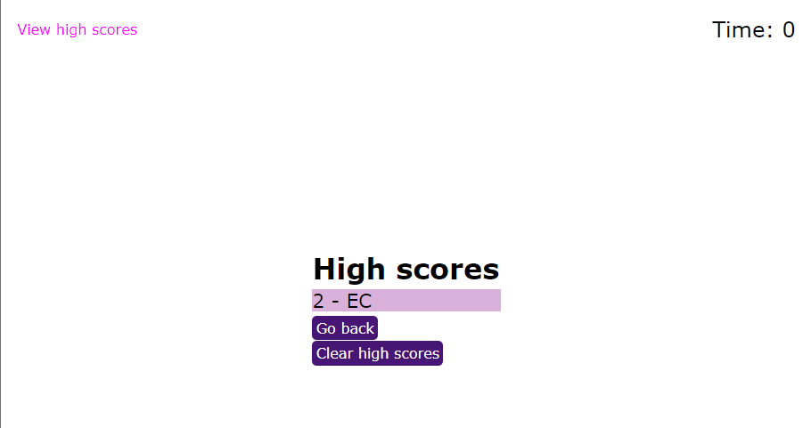

# Module 4 Code Quiz

## Description
MSU Coding Bootcamp Module 3 Challenge: Code Quiz

The purpose of this project was to use Javascript, CSS, and HTML to create a code quiz web application that keeps track of a player's score and applies a timer. If the correct answer is selected, the user gains 1 point. If the incorrect answer is selected the user loses 10 seconds off the timer. I learned about data attributes and event listeners with this project. 

[website] (https://eciarabellini.github.io/Mod4-Code-Quiz)

## Installation
n/a

## Usage
The user clicks "Start Quiz" to begin. The application then cycles through questions. Once the timer reaches 0 or all the questions have been answered, the user's score is displayed. They can then enter their initials to be added to the scoreboard screen. Future enhancements to this application would include a working high-scores scoreboard that tracks differnet scores across games. 

## Credits
None

## License
MIT License